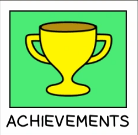

<!DOCTYPE html>
<html lang="en">
<head>
    <meta charset="UTF-8">
    <meta http-equiv="X-UA-Compatible" content="IE=edge">
    <meta name="viewport" content="width=device-width, initial-scale=1.0">
    <title>Hashim Niaz - Personal Website</title>
    <link rel="stylesheet" href="webstyle.css">
</head>
<body>
    <header>
        <h1>Hashim Niaz</h1>
        
Welcome to my Personal Homepage

    </header>
    <nav>
        <a href="#about">About</a>
        <a href="#skills">Skills</a>
        <a href="#Experience">Experience</a>
        <a href="#Education">Education</a>
        <a href="#Achievment">Achievement</a>
        <a href="#Contact">Contact</a>
    </nav>
    <section id="about">
        <h2>About Me</h2>
        

            

                
I am a fourth-year student at York University currently pursuing an undergraduate degree in Information Technology (BA). I studied the International Baccalaureate Diploma, emphasizing IB traits such as principled, communicators and leadership. I am a motivated young individual who has led several entities throughout my academic career such as the student council and a delegation in the Model United Nations, while my professional career reflects my commitment and efficiency at Intact Financial Corporation – Belairdirect, resulting in a recent promotion.

            

            

                
            

        

    </section>
    <section id="skills">
        <h2>Skills</h2>
        

            
            <ul>
                <li>Enthusiastic, exhibiting positive attitude in problem solving, dealing with clients.</li>
                <li>Familiar with various coding languages, including Python, C++, and Java.</li>
                <li>Excellent time management skills, highly punctual</li>
                <li>Able to multitask with thorough communication and leadership skills evolved through academic projects, captaining cricket team, volunteering, and work experience</li>
            </ul>
        

    </section>
    <section id="Experience">
        <h2>Specialist Sales and Customer Service 2023/11 – PRESENT</h2>
        

            
            <ul>
                <li>I served as a pivotal link between customers and insurance coverages for their most valuable assets, providing expert advice,</li>
                <li>Actively contributing to new initiatives</li>
                <li>Enhanced communication skills, teamwork collaboration, and tech proficiency. </li>
            </ul>
        

    </section>
    <section id="Experience">
        <h2>Store Advisor 2022/09 – 2022/12</h2>
        

            <ul>
                <li>Was responsible to maintain and organize merchandise in shelves</li>
                <li>Processed product returns aiding customers to fulfill alternative needs.</li>
                <li>Enhanced communication, teamwork, organization, and leadership skills.</li>
            </ul>
            
        

    </section>
    <section id="Experience">
        <h2>Tech Support Intern 2022/05 – 2022/08</h2>
        

            <ul>
                <li>Contributed to the data testing team, utilizing C++ to test codes.</li>
                <li>Reported errors to the software team and proposed alternative solutions.</li>
                <li>I efficiently managed to develop the required codes, showcasing my proficiency in industry-standard software. </li>
            </ul>
            
        

    </section>
    <section id="Education">
        <h2>Brock University BSc Computer Science 2020 – 2021</h2>
        

            
            <ul>
                <li>During my time at Brock University, I pursued a Bachelor of Science degree in Computer Science. This experience enriched my understanding of core computer science concepts and honed my analytical and problem-solving skills. I engaged in various projects and coursework that deepened my knowledge of programming languages and algorithms.</li>
            </ul>
        

    </section>
    <section id="Education">
        <h2>York University BA Information Technology 2021 - Present</h2>
        

            <ul>
                <li>A dedicated student currently pursuing a Bachelor's degree in Information Technology at York University. With a background in the International Baccalaureate Diploma, I embody traits such as principled leadership and effective communication. </li>
            </ul>
            
        

    </section>

    <section id="Achievment">
        <h2>Achievement</h2>
        

            <ul>
                <li>Top 5% efficiency rate within Ontario at Belairdirect</li>
                <li>Top 3 sales within the team, cross-selling home, and auto solutions</li>
                <li>Built a hydraulic-robotic arm in a tech fair and won first place.</li>
                <li>Led a National Day event. Tasks included: Leading meetings, assigning roles to individuals</li>
            </ul>
            
        

    </section>

    <section id="Contact">
        <h2>Contact</h2>
        

           
Hashim00@my.yorku.ca

            
        

    </section>
    
    <footer>
        
&copy; Hashim Niaz. All rights reserved.

        

            
            
            
        

    </footer>
</body>
</html>
